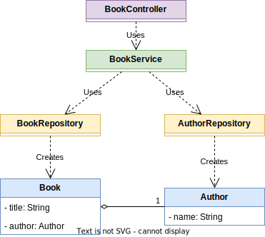

# Using the @Autowired annotation to inject beans

> This project is based on chapter **3.2. Using the @Autowired annotation to inject beans** from book **Spring Starts here (2021)** by Laurentiu Spilca.

## Class diagram



## Create Maven project with Intellij Idea

File > New project > Java

## Add Spring Context dependency

```xml
<dependency>
    <groupId>org.springframework</groupId>
    <artifactId>spring-context</artifactId>
    <version>6.1.10</version>
</dependency>
```

## Create entities

```java
public class Book {
    private final String title;
    private final Author author;

    public Book(String title, Author author) {
        this.title = title;
        this.author = author;
    }

    public String getTitle() {
        return title;
    }

    public Author getAuthor() {
        return author;
    }
}
```

```java
public class Author {
    private String name;

    public Author(String name) {
        this.name = name;
    }

    public String getName() {
        return name;
    }
}
```

## Create repositories

- use `@Repository` annotation to mark classes as bean

```java
@Repository
public class AuthorRepository {
    public Author getAuthor() {
        return new Author("F. Scott Fitzgerald");
    }
}
```

```java
@Repository
public class BookRepository {
    public Book getBook(Author author) {
        return new Book("The Great Gatsby", author);
    }
}
```

## Create service

- use `@Autowired` annotation to inject `BookRepository` through the class field
- use `@Autowired` annotation to inject `AuthorRepository` through the setter method
- use `@Service` annotation to mark class as bean

```java
@Service
public class BookService {
    @Autowired
    private BookRepository bookRepository;
    private AuthorRepository authorRepository;

    @Autowired
    public void setAuthorRepository(AuthorRepository authorRepository) {
        this.authorRepository = authorRepository;
    }

    public Book getBook() {
        final Author author = authorRepository.getAuthor();
        return bookRepository.getBook(author);
    }
}
```

## Create controller

- use `@Autowired` annotation to inject `BookService` through the constructor parameter
- use `@Controller` annotation to mark class as bean

```java
@Controller
public class BookController {
    private final BookService bookService;

    @Autowired
    public BookController(BookService bookService) {
        this.bookService = bookService;
    }

    public Book getBook() {
        return bookService.getBook();
    }
}
```

## Create configuration class

- use `@ComponentScan` annotation to configure component scan

```java
@Configuration
@ComponentScan(basePackages = "org.example")
public class ApplicationConfiguration {
}
```

## Create Spring context

```java
ApplicationContext context = new AnnotationConfigApplicationContext(ApplicationConfiguration.class);
```

## Get bean from Spring context

```java
Book book = context.getBean(BookController.class).getBook();
System.out.println("The book is: " + book.getTitle() + " by " + book.getAuthor().getName());
```

